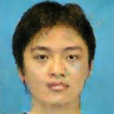

# Drawing to Face
This project is based on pix2pix architecture which is a conditional Generative Adversarial Network (cGAN) that is trained to convert a drawing to a face, specifically [its Tensorflow implementation](https://github.com/affinelayer/pix2pix-tensorflow). Special thanks to the people who made this possible.

## Dataset
I used CUHK sketches and faces dataset, which contains 188 pair of faces and sketches. To prepare the dataset, I created cropper and combiner scripts. The cropper script crops the faces from the original dataset and the combiner script combines the faces and sketches into pairs.

## Training
I trained the model for 200 epochs and the loss was around 0.1. You can use the command to train the model: 
```
python pix2pix.py --mode="train" --output_dir="images/output" --max_epochs="200" --input_dir="images/combined/train" --which_directi
on="BtoA"
```

## Testing
I reserved 4 pairs of images for testing. You can use the command to test: 
```
python pix2pix.py --mode="test" --output_dir="images/test" --input_dir="images/combined/test" --checkpoint="images/output"
```
For more information about the parameters, please refer to the original Tensorflow implementation.

## Results
Here are some results of the model. The first column is the input, the second column is the ground truth, and the third column is the output of the model.
<table>
<thead>
    <tr>
        <th>Input</th>
        <th>Ground Truth</th>
        <th>Output</th>
    </tr>
</thead>
  <tr>
    <td></td>
    <td></td>
    <td></td>
    </tr>
    <tr>
    <td></td>
    <td></td>
    <td></td>
    </tr>
</table>